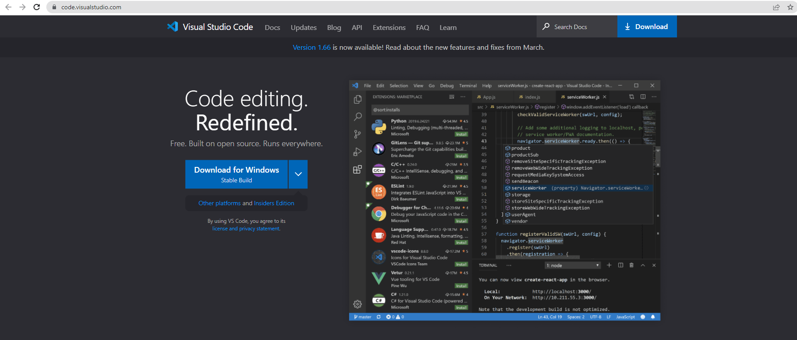
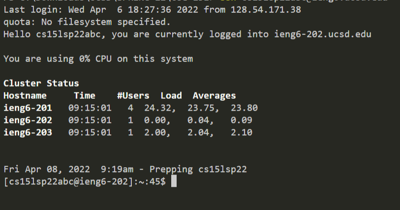
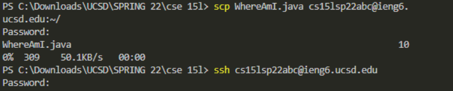
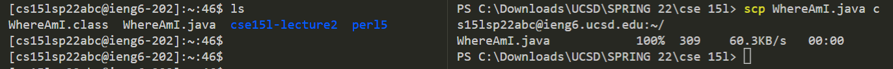
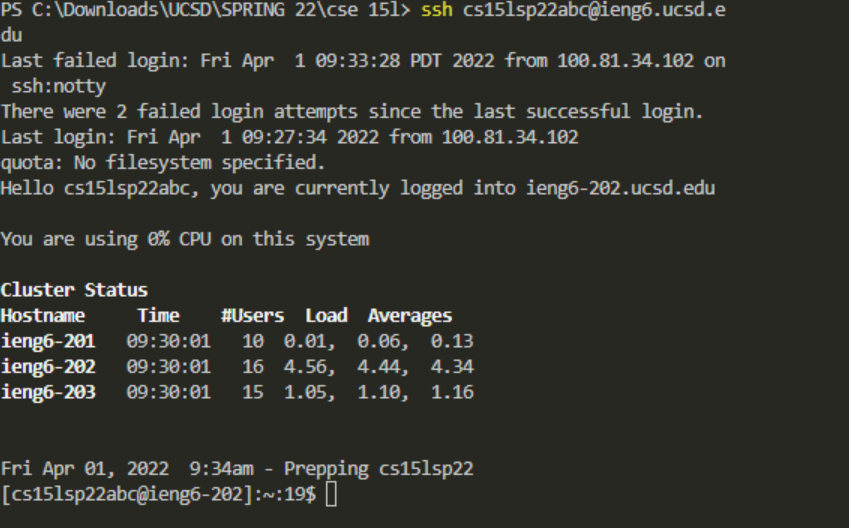
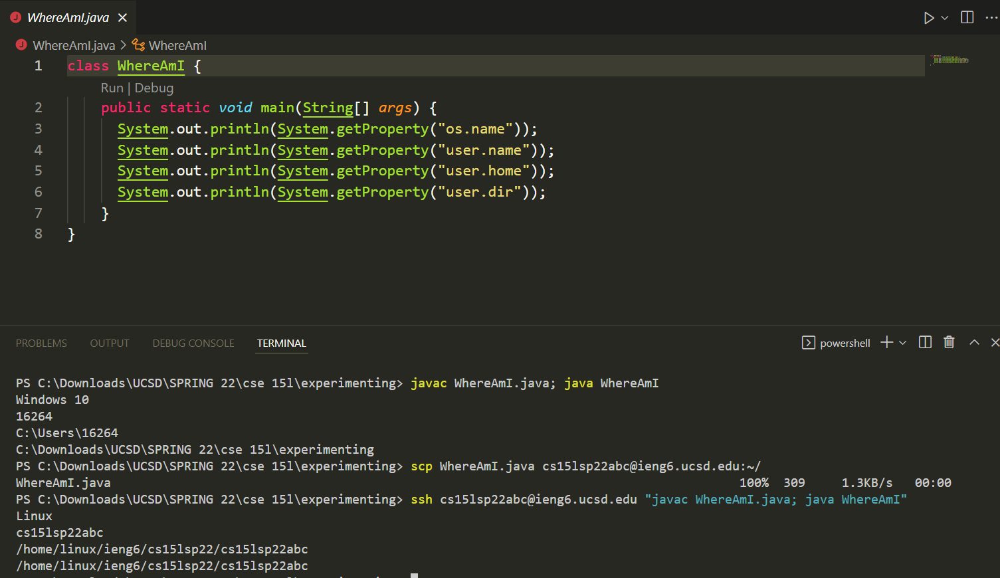

# Lab Report 2
---
### 1. **Installing VScode**


* Begin by going on the [VScode Website](https://code.visualstudio.com/) and using the appropriate download to install VScode. Choose the operating system that corresponds to the one that you are using.


### 2. **Remotely Connecting**

* [Install OpenSSH](https://docs.microsoft.com/en-us/windows-server/administration/openssh/openssh_install_firstuse).This will allow you to connect with other computers. Then look for your course-specific account with [this](https://sdacs.ucsd.edu/~icc/index.php).
* Open up VScode and type in the following command to the terminal

    `ssh cs15lsp22(account name)@ieng6.ucsd.edu`
* Proceed by typing yes and giving your password.

*Expect to see something like the image above.*

### 3. **Trying Some Commands**
* Try some of the commands provided from Lab 1!

1) cd ~
2) cd
3) ls -lat
4) ls -a
5) ls (directory)
6) cp (directory)
7) cat (directory)

* Being familiar with these commands will give you a better idea of what you can and cannot do on both the local and remote server.


*An example of using both the scp and ssh command*

### 4. **Moving Files with scp**
* To copy a file, we'll be using the command:

`scp fileName.java cs15lsp22(account name)@ieng6.ucsd.edu:~/`

* After proceeding with your password, you should connect to the remote computer using ssh.
* Using `ls`, you'll find that the file you moved in the home directory.



*An example of what to expect from typing in these commands using a java file named WhereAmI.java*

### 5. **Setting an SSH Key**
* Since constantly having to add your password could be a pain and take up a lot of time, we'd like to set up an SSH key that allows us to skip this process.
* Proceed by entering the following into the local terminal.
```
$ssh-keygen
```
* Save the key in a file and then proceed by entering an empty passphrase

* Lastly, we can copy the public key to the .ssh directory on the server by logging in to the server, logging out and back into the client, and then entering this command:

`scp /Users/<user-name>/.ssh/id_rsa.pub cs15lsp22(account name)@ieng6.ucsd.edu:~/.ssh/authorized_keys`



*You should expect to see something similar to this*

### 6. **Optimize Remote Running**

* Note that you can run multiple commands on a single line using ; to optimize the number of keystrokes you need to run a command
* The picture below shows what it may look like to run these commands simultaneously. Try it out!

 

