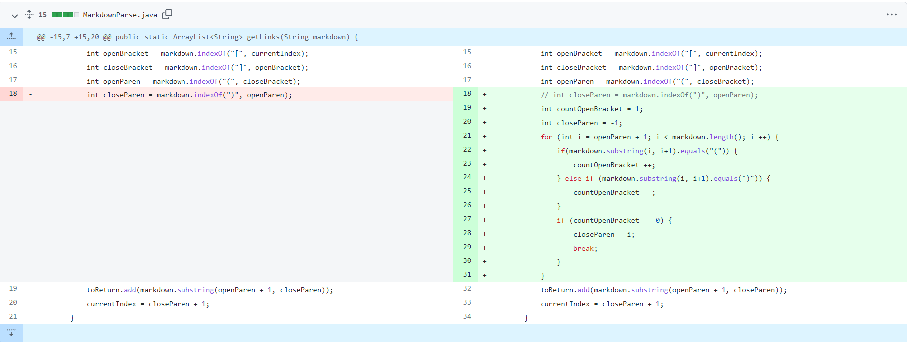
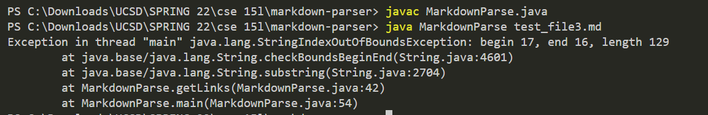
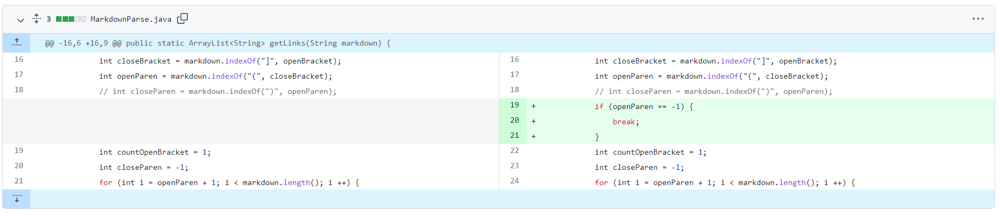
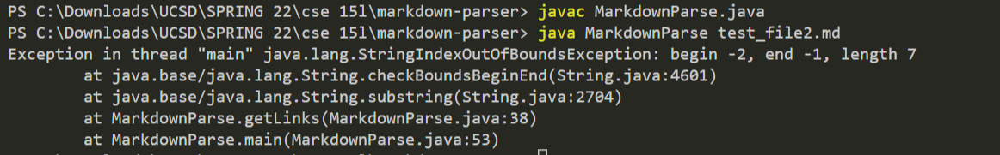
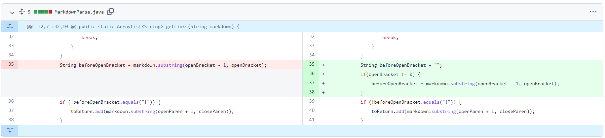
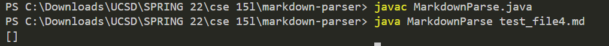

# Lab Report 2

## **Code Change #1**

[Failing Test](https://raw.githubusercontent.com/ctanma/markdown-parser/main/test_file3.md)

When testing the code with a test file that includes a link that includes parentheses,  an IndexOutOfBoundsException symptom occurs. The bug in the code looks for the first closing parenthesis so it would cut off the link early and mess up the indices.

## **Code Change #2**

[Failing Test](https://raw.githubusercontent.com/ctanma/markdown-parser/main/test_file2.md)

When testing the code with a test file that doesn't include a link, an IndexOutOfBoundsException symptom occurs. This is due to the fact that the bug in the code did not check whether or not there was a parenthesis to check if a link was there.

## **Code Change #3**

[Failing Test](https://github.com/ctanma/markdown-parser/blob/main/test_file4.md)

When testing the code with a test file that includes an image file and link, we should expect the output to include a link and exclude the image file but instead, it doesn't include either. The bug in the code doesn't correctly look for an "!" to check that it is looking at an image.