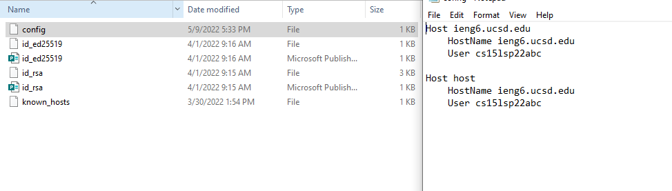
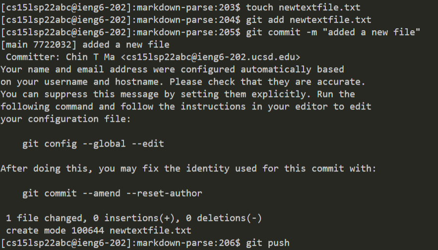
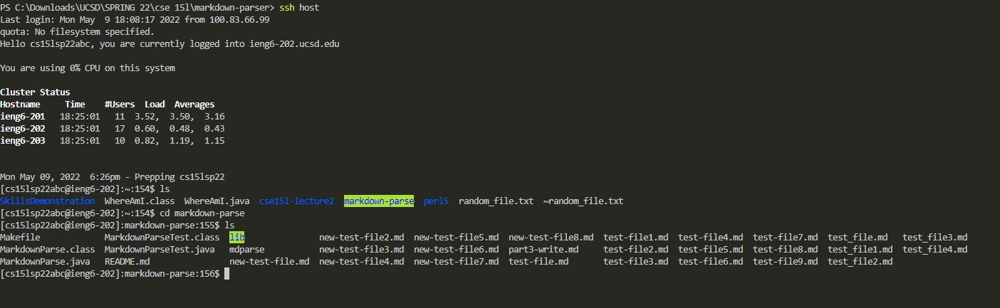

# Lab Report 3

---
## Streamlining ssh Configuration

*I added a config file that keeps my alias as "host" rather than having to constantly type out the full username each time.*

*The picture above showcases that I can log in to the remote computer without having to put in my entire username.*

*The picture above showcases copying over a text file over to the remote computer using the new alias I gave myself (host). "ls" is used to show that it successfully copied over.*

## Setup Github Access from ieng6

*This is where my public key is located on the Github website.*

*This is where my private keys are held inside of the remote computer.*

*The picture above showcases the use of git add, commit, and push. This ends up pushing the changes we made onto Github. You can see the commit file [here](https://github.com/ctanma/markdown-parser/commit/8ef8ecd38a25bc081447084ffc10e9e7ea3fec15).*

---

## Copy whole directories with scp -r

*The first picture above showcases copying over the entire directory of markdown-parse onto the remote computer. The second picture above shows that I successfully copied everything over.*

*Here, I log into the remote computer and run the tests manually*

*Lastly, I can combine commands including `scp`, `;`, and `ssh` in order to run everything on a single line.*

