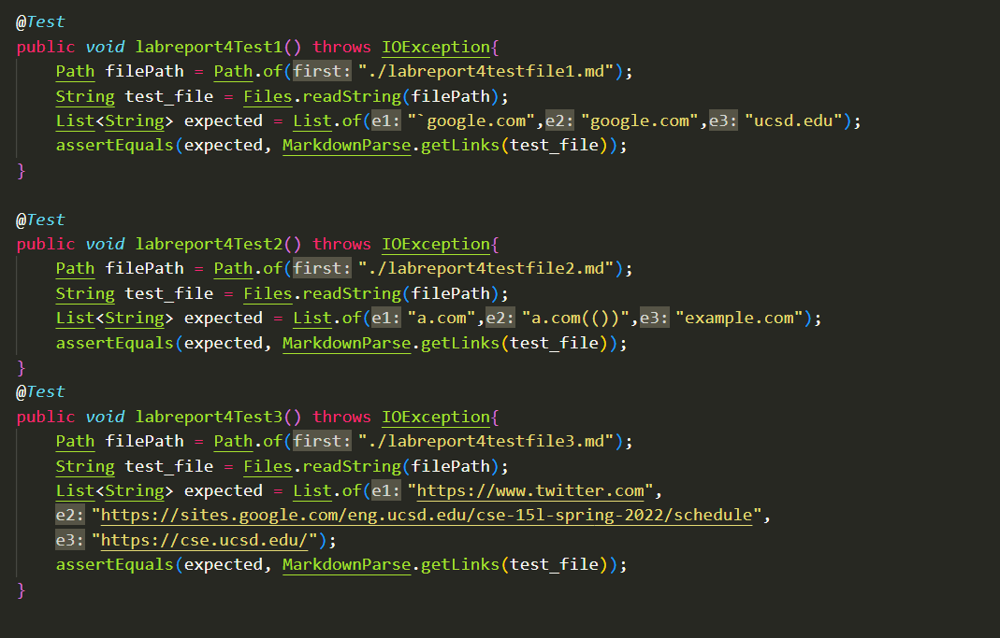
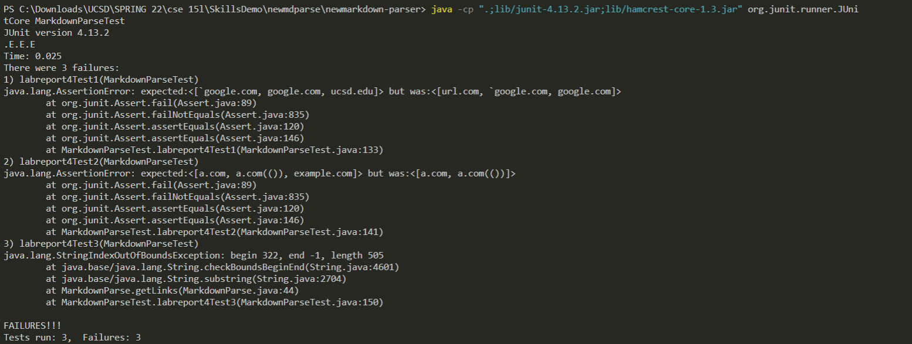
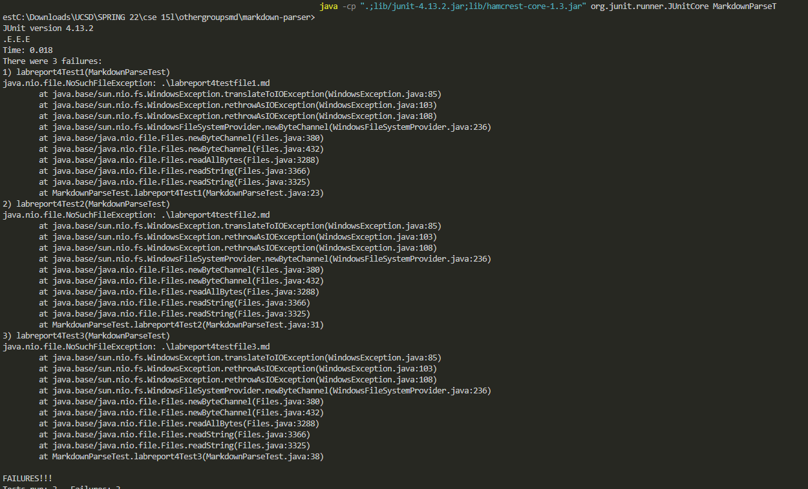

# Lab Report 3

---
## Testing Code

In this lab report, we will be using these two respositories.

[My personal repository](https://github.com/ctanma/markdown-parser)

[Reviewed Repository](https://github.com/mrreganwang/markdown-parser)

Using the MarkdownParse code given in each repository, I ran these tests in both repositories which showcase the expected values for the provided snippets.

Here was the output that my repository received.

Here was the output that the reviewed repository received.

---
# To address the errors found in my code, there are possible changes that could have been made.

## Snippet 1
I think that it is possible to include code that checks whether or not there are backticks in the line and checks the location of them to see whether or not it falls in between the brackets. If it does fall in between the brackets, we’ll add another conditional that checks for brackets inside of the backticks. 

## Snippet 2
I think that a possible code change could set some sort of counter that counts the number of open parentheses,brackets, and escaped brackets. It counts the number of each opening symbol and keeps going until an open parenthesis is found. If one is found and the number of opening symbols and closing symbols are equal, then the link is viable. 

## Snippet 3
The test fails because the next closing parenthesis is after the new open bracket which causes the index values of the closing parentheses and open brackets to conflict. To fix this, a possible code change would be to check for open brackets after a closing bracket if the parentheses haven't been closed off yet. This would let the program know that the previous text was not a viable link.
