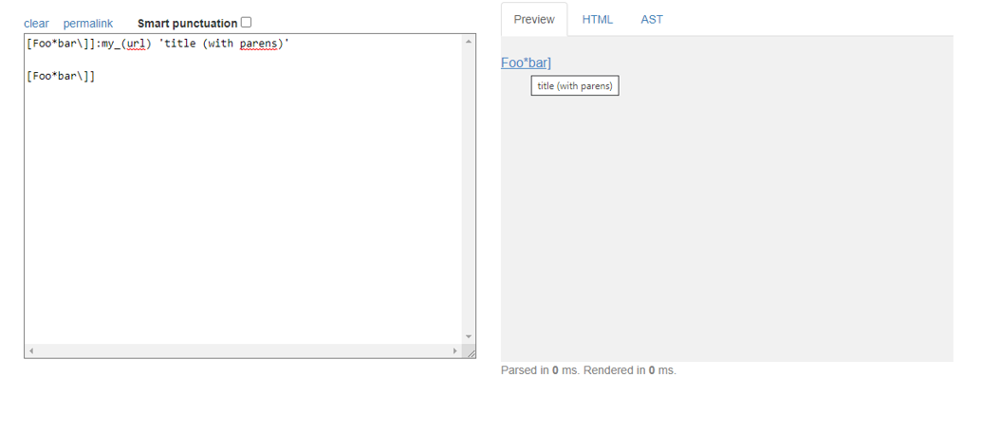
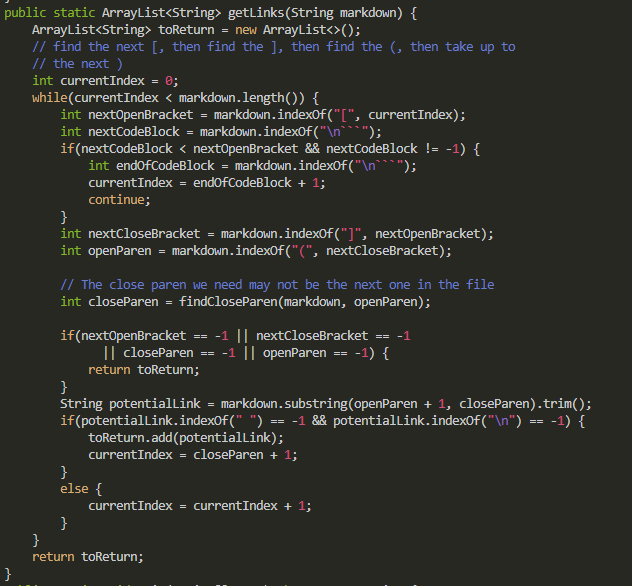
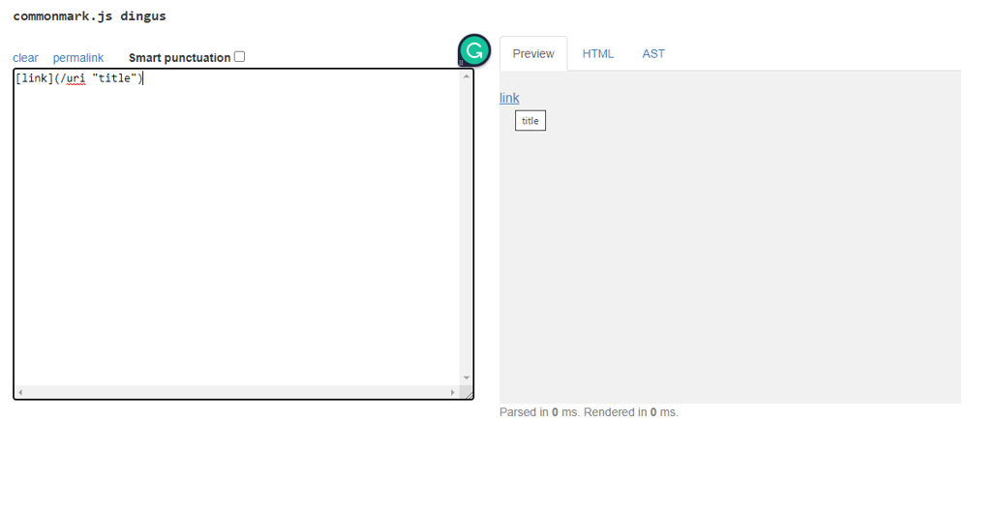
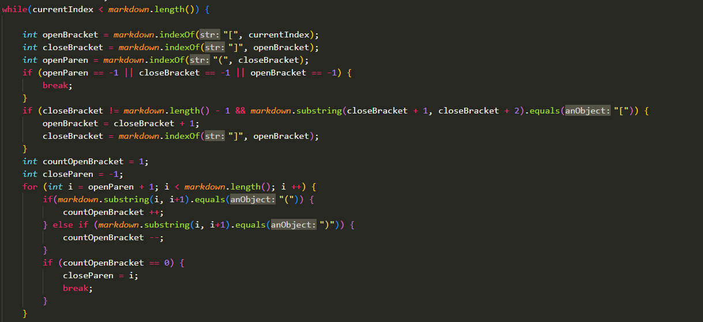

# Lab Report 5

---
## Comparing Code Implementations
Using vimdiff allowed for me to find the differences between the two files. I had to use bash script.sh in order to save the files onto results.txt in both my implementation and the implementation provided and then using vimdiff, I was able to compare the differences between the two respective result.txt files. I found there to be differences in test files [194](https://github.com/nidhidhamnani/markdown-parser/blob/main/test-files/194.md) and [481](https://github.com/nidhidhamnani/markdown-parser/blob/main/test-files/481.md).

# Test file #194
For test file #194. Here are the outputs given by both implementations (my personal implementation on the left and the given implementation on the right).

And down below is the expected results.

Looking at the implementation given, we find that the actual results was produced because the code simply looks at the first set of parentheses given when in the given results, the correct value comes afterwards. Here is the code that leads to it's failure.

#Test file #481
For the test file #481. Here are the outputs given by both implementations (my personal implementation on the left and the given implementation on the right).

And down below is the expected results.

Looking at my implementation, I believe that the results that I produced was because the code fails to account for the case when there is a "/". Based off how markdown works, the /url should be ignored and the link provided should simply just be "title". In order to account for this, code could be included in my implementation that checks for "/" and ignores the string until a valid link is found. An if statement placed in the beginning may be helpful in implementing this.
